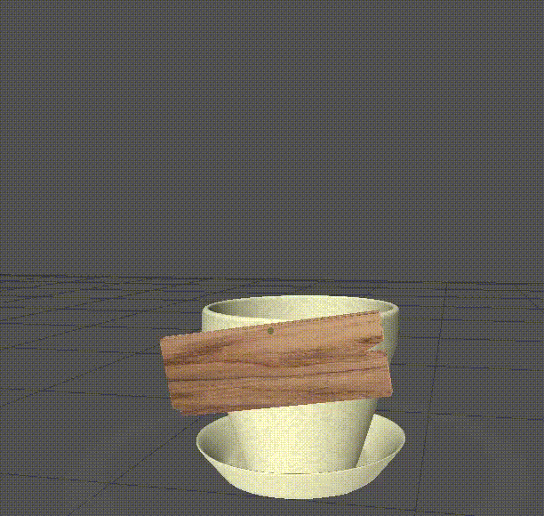

# Template for the Read the Docs tutorial

This GitHub template includes fictional Python library
with some basic Sphinx docs.

(Note I changed the README file's format from .rst to .md)

Just now testing putting a video file into our MD doc here:

Anyway, ReadTheDocs tutorial here:

<https://docs.readthedocs.io/en/stable/tutorial/>
